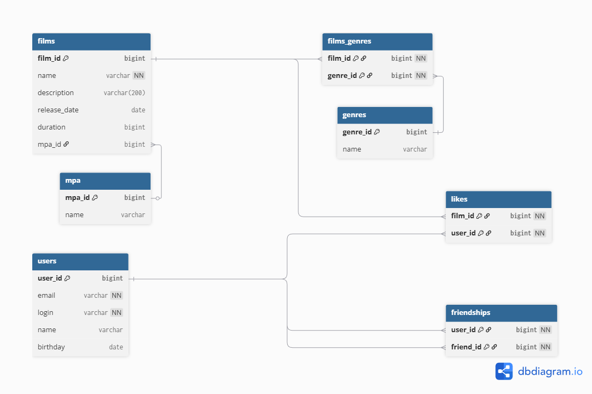

# Filmorate

## О проекте

Filmorate - это RESTful API для управления фильмами и пользователями.
Сейчас приложение позволяет добавлять, обновлять и просматривать информацию о фильмах и пользователях.

## Схема базы данных
()

- #### films - хранит все фильмы
- #### users - хранит всех пользователей
- #### mpa - хранит MPA рейтинг
- #### genres - хранит жанры
- #### films_genres - связующая таблица между фильмами и жанрами
- #### likes - хранит лайки фильма
- #### friendships - хранит друзей пользователя

## Модели данных

### Film
```json
{
  "id": 0,           // требуется только для обновления
  "name": "string",     // обязательное поле
  "description": "string", // опциональное поле, не может быть больше 200 символов
  "releaseDate": "2000-01-01", // опциональное поле, должно быть после 1985-01-28
  "duration": 10        // опциональное поле, продолжительность в минутах, должно быть больше 0
}
```


### User
```json
{
  "id": 0,           // требуется только для обновления
  "email": "string@string.string",     // обязательное поле, должно быть формата name@domain
  "login": "string", // обязательное поле, не должно быть пустым и содержать пробелы
  "name": "string", // опциональное поле, при отсутсвии совпадает с login
  "birthday": 10        // опциональное поле, дата рождения, не должна быть в будущем
}
```

## API Endpoints

### Фильмы
```
GET    /films       - получить все фильмы
POST   /films       - создать новый фильм
PUT    /films       - обновить существующий фильм
```

### Пользователи
```
GET    /users       - получить всех пользователей  
POST   /users       - создать нового пользователя
PUT    /users       - обновить существующего пользователя
```

## Обработка ошибок

Приложение возвращает стандартизированные ошибки в формате:
```json
{
  "message": "Bad Request",
  "status": 400,
  "errors": {
    "duration": "должно быть больше 0"
  },
  "timestamp": "2025-10-11T15:45:29.7558387",
  "path": "/films"
}
```

или в формате:

```json
{
  "timestamp": "2025-10-11T12:46:21.315+00:00",
  "status": 405,
  "error": "Method Not Allowed",
  "path": "/films"
}
```
